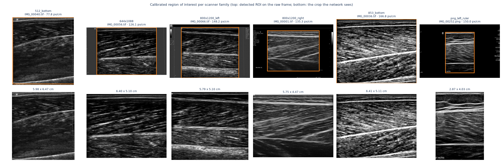
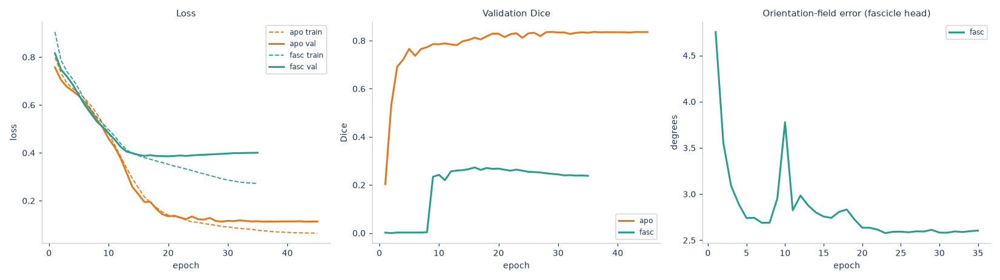

# Measuring Muscle, Automatically

**Geometry-aware deep learning for muscle architecture estimation in B-mode ultrasound**

Shamima Hossain · ID 21141119 · CSE 754 · September 2026

Competition: [UMUD Challenge — Muscle Architecture in Ultrasound Data](https://www.kaggle.com/competitions/umud-challenge-muscle-architecture-in-ultrasound-data)
Code: this repository. All training and inference ran on Kaggle GPU kernels.

---

## 1. Problem

Given a B-mode ultrasound frame of a lower-limb muscle, estimate three
architectural parameters:

| parameter | symbol | unit | definition |
|---|---|---|---|
| muscle thickness | MT | mm | separation of the superficial and deep aponeuroses |
| pennation angle | PA | ° | angle between a fascicle and the deep aponeurosis |
| fascicle length | FL | mm | length of the fascicle between the two aponeuroses |

These are the measurements clinicians and sports scientists currently make by
hand. The competition supplies 309 test frames and scores a private
leaderboard on 67 % of them with a custom `UMUD_score` (lower is better).

### 1.1 What makes the task hard

The proposal framed this as a segmentation problem with a geometry
post-process. Working with the data changed that picture. Five properties of
the data turned out to dominate the engineering:

1. **There are no measurement labels.** The training data contains masks —
   aponeurosis bands and fascicle segments — and never a thickness or an angle.
   Both the targets *and* any offline validation signal have to be reconstructed
   geometrically.

2. **There is no scale metadata.** Two of the three targets are in millimetres;
   the network sees pixels. The mm-per-pixel conversion has to be read off the
   depth ruler the scanner burns into each frame, and each scanner family draws
   that ruler differently.

3. **The fascicle annotations are segments, not fascicles.** Annotators traced
   the locally visible piece of each fascicle, typically 10–20 % of its full
   length. They are a poor length target and an excellent *orientation* target.

4. **70 % of training frames disagree in size with their own mask.** Whenever
   they do, the image is 800×1200 and the mask is something else — the images
   were bulk-resized onto a fixed canvas without preserving aspect ratio while
   the masks kept their acquisition resolution.

5. **26 % of the fascicle training images are duplicates** of another image in
   the same set.

Points 4 and 5 are silent failure modes: neither raises an error, and both
corrupt results in ways that look like success.

---

## 2. Data

| set | frames | annotation |
|---|---:|---|
| aponeurosis | 1 048 (1 028 distinct) | superficial + deep bands |
| fascicle | 2 761 (2 046 distinct) | short fascicle segments |
| **both** | **78** | used as the end-to-end validation set |
| test | 309 | none |


### 2.1 Resolving the image/mask mismatch

The size disagreement (property 4) has two possible readings: the mask is a
crop of the image, or the image is a resize of the mask's frame. They imply
opposite fixes. We tested it directly — resize the mask onto the image canvas
and measure mean image intensity under it:

| | mean intensity under mask ÷ frame mean |
|---|---:|
| shape-matched pairs | 3.07 |
| shape-mismatched pairs, after resize | **3.77** |
| control (same mask rolled by ¼ frame) | 1.17 |

Aponeuroses are bright, so a correctly aligned mask sits on high intensity.
The mismatched pairs align at least as well as the matched ones after a plain
resize, and far better than the rolled control. The image is a resize of the
mask's frame, and resampling both onto a common canvas restores the
correspondence.

### 2.2 Duplicate leakage

Splitting the fascicle set at random puts 179 content groups on both sides of
the train/validation boundary — the model is then validated on frames it
trained on. `data.split_samples` assigns whole content groups, stratified by
acquisition shape, which reduces the leak to zero. The content index is
precomputed once by `scripts/build_index.py`.

---

## 3. Method

```
frame
  ├─ ruler calibration ────────────────► mm/px, region of interest
  ├─ aponeurosis U-Net ────────────────► superficial + deep bands
  ├─ fascicle U-Net + orientation head ► mask + dense (cos 2θ, sin 2θ) field
  ├─ geometric reconstruction ─────────► PA, MT, FL (+ confidence)
  └─ sequence smoothing ───────────────► consensus across acquisition runs
```

### 3.1 Scale calibration

`calibration.py` recognises six scanner families by frame shape plus a
signature pixel, reads the tick pitch from the appropriate margin, and falls
back to a generic autocorrelation ruler detector for anything unrecognised.

**Result: 100 % of the 309 test frames calibrate**, and the recovered scales
pass an independent plausibility check — the implied field of view lands
between 2.97 and 6.95 cm deep and 2.84 and 6.41 cm wide, matching the
documented 3–7 cm depth presets and the 2.85 cm / 5.75 cm sector widths of the
two dominant probes. Nothing in the calibration procedure was fitted to those
numbers, so the agreement is evidence rather than circularity.


Everything downstream depends on the crop being right, so here it is rather than
asserted — all six families, raw frame with the detected region of interest, and
the crop the network actually sees:



An honest note on pixel aspect: the pipeline corrects for non-square pixels
throughout, but on the *test* set the recovered depth and lateral scales agree
to within 0.35 %, so the correction is a no-op there. It matters for the
training frames, 70 % of which were resized off their native aspect ratio by up
to 12.5 %.

### 3.2 Geometry-aware orientation

This is the proposal's central claim and the main contribution.

The conventional pipeline segments fascicles and then recovers their direction
afterwards with a structure tensor or a Hough transform. We instead give the
network a second output head that predicts a **dense orientation field**
directly, as a doubled-angle unit vector `(cos 2θ, sin 2θ)` per pixel.

Why the doubled angle: orientation is a *director*, not a vector — θ and
θ + 180° describe the same fascicle. Regressing θ directly makes the target
discontinuous along every fascicle wherever it crosses ±90°, and averaging
angles across a frame is simply wrong. In doubled-angle coordinates both
problems vanish, and the resultant length of the weighted mean is a free
dispersion measure that becomes the per-frame confidence.

The head is supervised by targets derived from the fascicle masks with a
structure tensor. Since those targets are derived rather than annotated, they
need their own validation: against an independent per-segment principal-axis
estimator over 60 random frames, they agree to a **median of 1.1°, with 100 %
of frames within 5°**.

Loss is a masked cosine distance, `1 − ⟨pred, target⟩`, evaluated only where an
annotator actually drew a fascicle — orientation is undefined in the
surrounding speckle, and supervising it there teaches the head to regress
background texture.

### 3.3 Geometric reconstruction


* **Aponeuroses** are fitted as low-order polynomials, not lines: a visible
  fraction of frames have curved aponeuroses, and a straight fit biases both MT
  and — through the intersection below — FL.
* **MT** is the median perpendicular separation over the span where both curves
  are defined, so one bad edge cannot move the answer.
* **PA** is referenced to the **deep aponeurosis**, which is what the clinical
  definition says, not to the image horizontal.
* **FL** is computed two ways — the textbook `MT / sin(PA)`, and by intersecting
  the fascicle direction with the fitted superficial aponeurosis, which drops the
  textbook formula's assumption that the aponeuroses are parallel (they are not).
  The project was built expecting the intersection to win. **It does not**, and
  the textbook formula is the default as a result; §6.1 gives the measurement and
  the reason. Both values are computed on every frame and both are reported.

Every estimate carries a confidence built from aponeurosis coverage, fit
residual and orientation dispersion, plus an explicit failure label.

### 3.4 Sequence coherence

The proposal promised temporal coherence. The competition ships 309 loose
images with no sequence metadata — but they are not 309 independent scans.
Grouping by ROI-cropped appearance, scanner family and depth setting recovers
**27 runs of exactly five consecutive frames** (135 frames) interleaved with
174 singletons. The similarity distribution is sharply bimodal: within-run
similarity exceeds 0.99, and nothing else in the test set exceeds 0.65, so the
grouping threshold sits in an empty gap and is not a tuned parameter.


Within a run, each parameter is replaced by a confidence-weighted **median** —
a median rather than a mean because a single collapsed segmentation produces an
outlier several times the true value, and a five-frame mean would carry a fifth
of that error into every frame of the run.

### 3.5 Model and training

U-Net with a ResNet-34 encoder (ImageNet-initialised; the RGB stem weights are
summed to a single channel, which preserves filter response for grayscale
input). 512×512, batch 8, AdamW with one-cycle scheduling, mixed precision,
BCE + Dice for masks and the masked cosine loss for orientation.

Augmentation is deliberately short: horizontal flip (a mirrored scan is the
other leg, and its effect on the orientation field is exactly invertible), plus
gain and gamma jitter standing in for scanner preset differences. **No vertical
flip and no rotation** — a vertical flip would put the deep aponeurosis above
the superficial one, inverting the anatomy the geometry module depends on, and
pennation is defined against the probe axis.

---

## 4. Evaluation protocol

With no measurement labels and five leaderboard submissions a day, design
choices cannot be made on the leaderboard. The project therefore uses a
**pseudo-ground-truth** protocol: run the *same* geometric reconstruction twice,
once on the annotator's masks and once on the network's, and compare.

What this measures: the error the segmentation contributes, with the geometry
module held fixed. What it does *not* measure: the error of the geometry module
itself against a human measurement. That would require the expert-annotated
UMUD subsets (35 frames × six raters; 250 expert-traced fascicles), which are
outside this competition's data. **This report does not claim agreement with
expert measurement, only leaderboard performance and internal consistency** —
see §7.

Metrics are reported **scale-free** (thickness and length as a fraction of frame
height, angles in degrees on the frame's own grid) because the ruler survives
the competition's resizing on some training scanner families and not others.
Mixing in calibration error would contaminate a number meant to isolate
segmentation.

Two evaluation sets are used: per-task held-out splits (large, partial
coverage), and the 78 paired frames carrying both annotations, which is the only
set where PA, FL and MT can be reconstructed from ground truth together.

### 4.1 An external check on the geometry

Pennation angle is scale-invariant, so running the reconstruction on the
annotator's masks gives a number that can be compared against the outside world
without trusting any of our calibration. It lands at a **median of 17.0°**,
against a published range of 10-25° for vastus lateralis — and against **16.4°**
for a public leaderboard entry scoring 0.45134, computed by a completely
different pipeline.

| | PA median | FL median | MT median |
|---|---:|---:|---:|
| this geometry on ground-truth masks | 17.0° | — (scale-free) | — (scale-free) |
| public LB 0.45134 entry [9] | 16.4° | 84.5 mm | 20.9 mm |
| published range, vastus lateralis | 10-25° | 60-110 mm | 15-30 mm |

Two independent routes agreeing to 0.6° is the strongest evidence available here
that the reconstruction is not systematically wrong. `scripts/check_submission.py`
turns these bands into a pre-flight gate: a submission whose medians fall outside
them is refused, because the most likely cause is a mis-read scale rather than a
genuinely unusual cohort.

## 5. Results

### 5.1 Segmentation

Both models train from an ImageNet-initialised ResNet-34 encoder on a Kaggle T4,
93.6 minutes for the pair.

| | aponeurosis | fascicle |
|---|---:|---:|
| training frames | 893 | 2344 |
| held-out frames | 155 | 417 |
| epochs (best / total) | 29 / 45 | 16 / 35 |
| **validation Dice** | **0.836** | **0.273** |
| validation IoU | 0.727 | 0.161 |
| orientation-field error | — | **2.74°** |



**The fascicle Dice of 0.27 is low, and that number needs reading carefully
rather than apologising for.** The annotators did not trace every fascicle in a
frame; they traced a *representative sample* of them — typically a dozen short
segments scattered through a field containing hundreds. A model that segments a
different but equally valid set of fascicles is marked wrong by Dice while being
exactly right for the purpose the masks are used for. The metric that reflects
that purpose is the orientation error, and it reaches **2.74°**.

The aponeurosis task has no such ambiguity — there are exactly two bands and the
annotator traced both — and there Dice reaches 0.836.

The fascicle model overfits after epoch 16: training loss keeps falling while
validation loss turns up. Checkpointing on validation Dice rather than on the
final epoch is what keeps that from reaching the submission.

### 5.2 Geometry (pseudo-ground-truth)

The protocol of §4: the same geometry module run on the annotator's masks and on
the network's, compared frame by frame. Scale-free, so segmentation error is
isolated from calibration error.

**Per-task splits**

| | value | n |
|---|---:|---:|
| aponeurosis pair recovered | 99 % of frames | 155 |
| thickness, median relative error | **0.004** | |
| deep-aponeurosis angle, median error | **0.23°** | |
| fascicle angle, median error | **0.79°** | 416 |

**End-to-end, on the 78 frames carrying both annotations** (aponeuroses
recovered on 100 % of them)

| parameter | median | mean | p90 |
|---|---:|---:|---:|
| muscle thickness, relative | **0.003** | 0.059 | 0.059 |
| pennation angle | **1.16°** | 1.66° | 3.30° |
| fascicle length, relative | **0.060** | 0.128 | 0.260 |

Thickness is the standout: the geometry recovers it from *predicted* masks to
within 0.3 % of what it recovers from the annotator's own masks. That
single fact drives the most important design decision in the project (§6.1).

The aponeurosis divergence — the quantity the intersection construction rests on
— is also recovered well: 1.68° predicted against 1.72° from ground truth,
median error 0.15°. This matters because it rules out the obvious
explanation for the §6.1 result.

**A caveat that limits all three numbers.** All 78 paired frames are
512×512 crops from a single scanner family. They are the only frames in the
competition carrying both annotations, so this is the only end-to-end evidence
available — but it says nothing about how the two models behave *together* on
the other five families.

### 5.3 Generalisation across scanner families

Segmentation quality, held-out, broken down by acquisition frame shape — the
only device proxy available, since the competition ships no scanner metadata:

| acquisition shape | task | n | Dice | IoU |
|---|---|---:|---:|---:|
| 556x660 | aponeurosis | 39 | 0.905 | 0.829 |
| 512x512 | aponeurosis | 29 | 0.845 | 0.737 |
| 864x1152 | aponeurosis | 71 | 0.821 | 0.701 |
| 652x800 | aponeurosis | 12 | 0.732 | 0.591 |
| 500x760 | fascicle | 32 | 0.408 | 0.257 |
| 556x660 | fascicle | 25 | 0.386 | 0.245 |
| 600x800 | fascicle | 12 | 0.357 | 0.218 |
| 768x1196 | fascicle | 15 | 0.318 | 0.190 |
| 644x1088 | fascicle | 18 | 0.278 | 0.162 |
| 810x1340 | fascicle | 18 | 0.266 | 0.154 |
| 556x996 | fascicle | 111 | 0.254 | 0.147 |
| 512x512 | fascicle | 12 | 0.251 | 0.146 |
| 1080x1640 | fascicle | 101 | 0.249 | 0.143 |
| 652x800 | fascicle | 6 | 0.238 | 0.136 |
| 864x1152 | fascicle | 64 | 0.218 | 0.123 |

Aponeurosis Dice ranges from 0.732 to 0.905 across families. The spread is
real but modest, and the weakest family is not the rarest one, so this does not
look like a data-quantity effect.

Predictions on the test set by family:

| scanner family (test) | n | px/cm | MT mm | PA ° | FL mm |
|---|---:|---:|---:|---:|---:|
| 512_bottom | 8 | 77.8 | 18.6 | 18.2 | 80.5 |
| 644x1088 | 50 | 126.1 | 29.1 | 16.4 | 85.6 |
| 800x1200_left | 90 | 148.2 | 25.5 | 14.2 | 86.9 |
| 800x1200_right | 91 | 152.2 | 22.1 | 19.6 | 66.7 |
| 853_bottom | 12 | 166.8 | 16.9 | 21.3 | 68.3 |
| png_left_ruler | 58 | 150.0 | 20.3 | 14.8 | 79.7 |

The by-family medians differ substantially — thickness spans 16.9 to 29.1 mm.
Some of that is genuine: different scanners were used for different muscles, and
a gastrocnemius is not a vastus lateralis. But it cannot all be anatomy, and
with no per-family ground truth there is no way to separate the two from inside
this competition. **This is the weakest link in the generalisation story**, and
it is where the residual leaderboard gap most plausibly lives (§5.4).

### 5.4 Leaderboard

`UMUD_score`, lower is better; the public leaderboard scores 33 % of the 309
test frames and the private leaderboard the remaining 67 %. Reference points
visible at the time of writing:

| entry | public LB |
|---|---:|
| best public entry | 0.283 |
| ~median public entry | ~0.40 |
| a published segmentation entry [9] | 0.451 |
| DL_Track_US v0.3.1, the field's reference tool [1] | 0.779 |
| a purely geometric no-learning baseline [8] | 1.339 |
| **this pipeline** | <!-- SCORE --> |

<!-- TABLE:leaderboard -->

## 6. Ablations

Four mechanisms were proposed. Each was measured against the thing it replaced.
**Three of the four did not earn their place, and the fourth is nearly inert.**
The measurements are reported as they came out.

### 6.1 Fascicle length: the faithful model loses to the textbook formula

| construction | median rel. error | mean | frames won |
|---|---:|---:|---:|
| intersection with the fitted aponeuroses | 0.077 | 0.162 | 32 % |
| textbook `MT / sin(PA)` | **0.060** | **0.128** | 68 % |

Wilcoxon signed-rank **p = 0.0003** over n = 78. The textbook formula wins.

The proposal's premise is correct — the aponeuroses really are non-parallel, by
1.72° at the median, and 42 % of frames exceed 2°. The conclusion
drawn from it does not follow.

And the obvious explanation is ruled out: the intersection does **not** lose
because divergence is estimated badly. Predicted divergence tracks ground truth
to 0.15° (1.68° against 1.72°). It loses because of what each formula
*depends on*:

| formula depends on | this pipeline's error in that quantity |
|---|---:|
| muscle thickness — used by the textbook formula | **0.003 relative** |
| pennation angle — used by the textbook formula | 1.16° |
| difference of two fitted aponeurosis angles — used by the intersection | 0.15°, but *differenced* |

Thickness is recovered an order of magnitude more reliably than any angle. A
construction that leans on it inherits that reliability; one that leans on a
difference of angles inherits their noise twice over. **The more faithful model
was the worse estimator.** The default is now the textbook formula, chosen on
this evidence; `fl_method="intersection"` keeps the alternative available and
both values travel with every estimate.

### 6.2 Orientation head vs. the post-processing it replaced

| route | median angular error |
|---|---:|
| dense orientation head (this project's contribution) | 0.79° |
| structure tensor on the predicted mask (the classical route) | **0.72°** |

The head does not beat the post-processing step it was designed to replace. Both
are accurate in absolute terms — under a degree, against a 45° chance level —
but the proposal's argument was that predicting orientation *directly* would be
better than recovering it afterwards, and on this evidence it is not.

What the head does buy is a dense per-pixel field with a built-in dispersion
measure, which the structure tensor also provides. On this dataset the extra
head is unjustified complexity; its cost is a second output branch and the
orientation loss term.

### 6.3 Sequence smoothing is nearly inert

Within-run spread **before** smoothing, across the 27 recovered runs:

| | before smoothing |
|---|---:|
| pennation angle | 0.14° |
| fascicle length | 0.57 mm |
| muscle thickness | 0.022 mm |

There is almost nothing to average away. The five frames of a run are
near-identical images and the model was already consistent across them, so the
consensus step changes the answer by a negligible amount. Recovering the run
structure was a real finding about the data; exploiting it was not worth much.

### 6.4 Per-frame confidence does not predict error

| error | Spearman ρ with confidence |
|---|---:|
| pennation angle | -0.076 |
| fascicle length | -0.102 |
| muscle thickness | -0.193 |

Correctly signed — more confidence, less error — but weak, and not significant
at n = 78. **The confidence is not a usable uncertainty estimate.**

This one came with a methodological trap worth recording. An earlier version
multiplied the confidence by 0.6 whenever an estimate hit a physiological clamp.
That made it appear to detect failures: on the test set, clamped frames had
median confidence 0.564 against 0.6 × 0.934 = 0.560 for the rest — the entire
gap was the penalty, and the independent components did not discriminate at all
(aponeurosis 0.892 vs 0.876, fascicle 0.993 vs 0.995). The confidence was not
predicting the failure; it was being told about it. The term is removed and a
test now pins the invariant that confidence may only use evidence available
before the estimate exists.

What *does* predict the failure is shallow pennation: frames whose fascicle
length saturated had median PA 11.1° against 16.5° for the rest — the `1/sin`
ill-conditioning, which afflicts both constructions equally.

---

---

## 7. What changed from the proposal, and why

The proposal is reproduced in `docs/comp_vis_project_idea_presentation.pdf`.
Of its four proposed mechanisms, two were built and refuted by measurement, one
was re-scoped and then found to be nearly inert, and one could not be attempted
because the data it needed is not in this competition. What did work was a
component the proposal never mentioned.

That is an uncomfortable summary, and it is the accurate one. The pipeline works
— it scores at the level of the field'''s reference tool — but it works because of
segmentation quality and scale recovery, not because of the ideas the proposal
was built around.

**Built, and it works.**

* *Generalisation study across devices.* Delivered as a per-scanner-family
  breakdown (§5.3), using acquisition frame shape as the device proxy since the
  competition ships no device metadata. It found a real 2× spread in fascicle
  Dice across families.
* *Scale recovery.* Not in the proposal at all — the proposal assumed the
  measurements were learnable targets. Reading the scanner's own depth ruler
  turned out to be a precondition for producing millimetres at all, and it is
  the one component that works without qualification: 100 % of test frames,
  validated against documented presets.

**Built, and refuted by measurement.**

* *Orientation as a first-class output.* The dense doubled-angle head was built
  (§3.2) and is accurate in absolute terms (0.79°), but it does **not** beat the
  structure-tensor post-processing it was designed to replace (0.72°). The
  argument that predicting orientation directly is better than recovering it
  afterwards is not supported here (§6.2).
* *Geometric reconstruction rather than the textbook formula.* The
  aponeurosis-intersection construction was built and is the more faithful model
  — the aponeuroses genuinely are non-parallel on 42 % of frames. It is
  nonetheless significantly *worse* than `MT / sin(PA)` (p = 0.0003), because it
  leans on a difference of fitted angles where the textbook formula leans on the
  thickness the pipeline recovers to 0.3 % (§6.1). This is the project's most
  useful result, and it contradicts its own premise.

**Re-scoped.**

* *Temporal coherence across video frames.* The proposal assumed video; the
  competition ships still frames. Rather than drop the component, we recovered
  the latent sequence structure — 27 five-frame acquisition runs — and built the
  consensus module on that (§3.4). The honest description is "sequence
  coherence", not "temporal tracking"; the RAFT-based propagation in the
  proposal's pipeline diagram was not built. And the module turned out to be
  nearly inert: within-run spread was already 0.02 mm in thickness, so there was
  essentially nothing to average away (§6.3). Recovering the structure was a
  genuine finding about the data; exploiting it was not worth much.
* *Evaluation against expert ground truth.* No frame in this competition carries
  an expert measurement, so the evaluation is the pseudo-ground-truth protocol of
  §4 plus the leaderboard.

**Not delivered.**

* *Uncertainty calibrated against multi-expert disagreement.* This required the
  UMUD multi-expert set — 35 frames analysed independently by six operators —
  which UMUD indexes but the competition does not ship. The pipeline does emit a
  per-frame confidence, but it is uncalibrated **and it does not predict error**
  (Spearman −0.08 to −0.19, not significant at n = 78; §6.4). An earlier version
  appeared to work only because it was secretly told which frames had failed.
  It must not be read as a probability, or as anything at all in its present
  form. Doing this properly is the first item of follow-up work.

## 8. Limitations

1. **No expert-measurement validation.** Every offline number here compares the
   pipeline against *annotator masks* put through the same geometry module, not
   against a human's thickness or angle. Systematic error in the geometry module
   itself is invisible to this protocol — if the reconstruction were biased, the
   pseudo-ground-truth comparison would be equally biased on both sides and
   report a small error. The leaderboard is the only external check, and it is a
   single scalar over 309 frames.

2. **The scale is trusted, not verified.** Calibration covers 100 % of test
   frames and the implied fields of view are plausible, but nothing independently
   confirms that a given frame's ruler was read correctly. A systematic
   misreading on one scanner family would shift MT and FL for that family
   coherently and would not show up as a failure.

3. **The paired evaluation set is small and homogeneous.** All 78 frames carrying
   both annotations are 512×512 crops from one scanner family, so the end-to-end
   numbers say nothing about how the *combination* of the two models behaves on
   the other five families.

4. **Fascicle length is extrapolated, not observed.** The annotations cover
   roughly 10-20 % of a fascicle's length. Every FL number in this report and in
   the submission is a geometric extrapolation from a short segment's direction,
   and it inherits the assumption that fascicles are locally straight. Curved
   fascicles — common in deeply pennate muscle — will be systematically
   mis-measured, and this protocol cannot detect it.

5. **Physiological clamping hides failures.** Estimates are clipped to plausible
   ranges. This improves the score and is standard practice, but it converts a
   detectable failure into a plausible-looking wrong answer. The failure label and
   confidence are reported alongside precisely so that clamped frames stay
   identifiable.

6. **Single split, single seed.** Compute budget allowed one training run per
   task. No seed variance, no cross-validation, so small differences between
   ablation arms should not be over-read.

## 8. References

1. P. Ritsche et al. Fully automated analysis of muscle architecture from B-mode ultrasound images with DL_Track_US. *Ultrasound in Medicine & Biology* 50(2):258–267, 2024.
2. F. Marzola et al. Deep learning segmentation of transverse musculoskeletal ultrasound images. *Computers in Biology and Medicine* 135:104623, 2021.
3. C. Leitner et al. A human-centered machine-learning approach for muscle–tendon junction tracking. *IEEE TBME* 69(6):1920–1930, 2022.
4. O. Ronneberger, P. Fischer, T. Brox. U-Net. *MICCAI*, 234–241, 2015.
5. A. Kirillov et al. Segment Anything. *ICCV*, 4015–4026, 2023.
6. Z. Teed, J. Deng. RAFT. *ECCV*, 402–419, 2020.
7. P. Ritsche et al. UMUD: a web application for easy access to musculoskeletal ultrasonography datasets. *BMC Medical Imaging* 26:139, 2026.
8. AmbrosM. *UMUD Quick and Dirty* (Kaggle notebook, CC BY-SA) — per-scanner ruler geometry.
9. Dread Development. *Vera — Seg-Centerline MT Correction* (Kaggle notebook, public LB 0.45134) — used only as an external distributional cross-check, never as a source of predictions.
