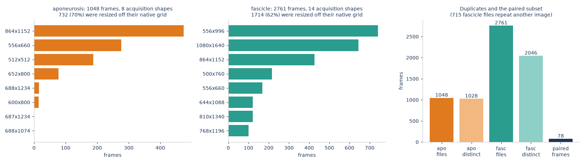
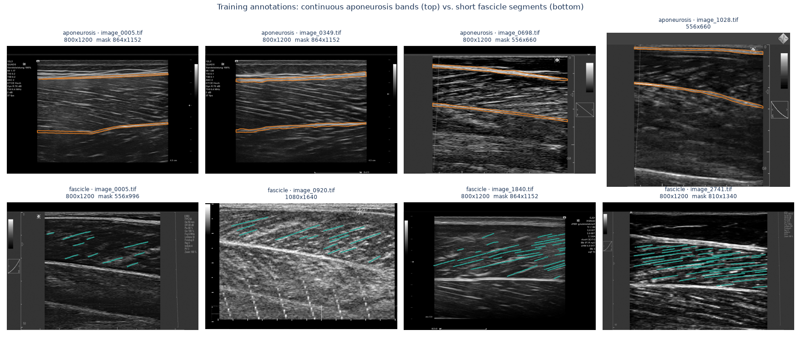
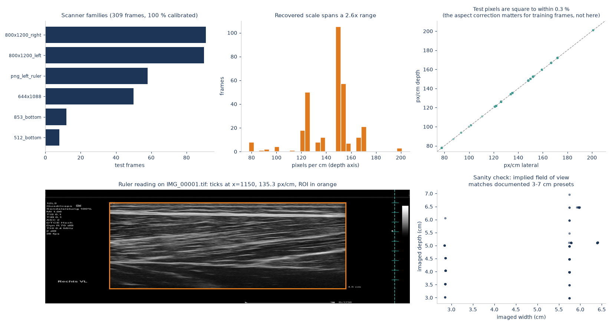
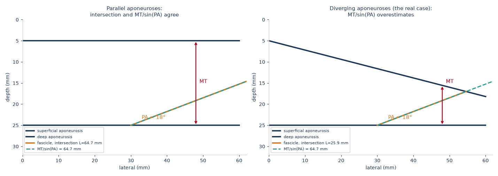
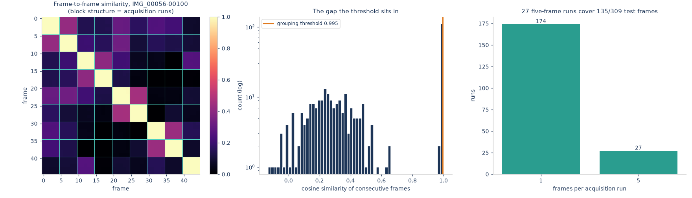

# Measuring Muscle, Automatically

**Geometry-aware deep learning for muscle architecture estimation in B-mode ultrasound**

Shamima Hossain · ID 21141119 · CSE 754 · September 2026

Competition: [UMUD Challenge — Muscle Architecture in Ultrasound Data](https://www.kaggle.com/competitions/umud-challenge-muscle-architecture-in-ultrasound-data)
Code: this repository. All training and inference ran on Kaggle GPU kernels.

---

## 1. Problem

Given a B-mode ultrasound frame of a lower-limb muscle, estimate three
architectural parameters:

| parameter | symbol | unit | definition |
|---|---|---|---|
| muscle thickness | MT | mm | separation of the superficial and deep aponeuroses |
| pennation angle | PA | ° | angle between a fascicle and the deep aponeurosis |
| fascicle length | FL | mm | length of the fascicle between the two aponeuroses |

These are the measurements clinicians and sports scientists currently make by
hand. The competition supplies 309 test frames and scores a private
leaderboard on 67 % of them with a custom `UMUD_score` (lower is better).

### 1.1 What makes the task hard

The proposal framed this as a segmentation problem with a geometry
post-process. Working with the data changed that picture. Five properties of
the data turned out to dominate the engineering:

1. **There are no measurement labels.** The training data contains masks —
   aponeurosis bands and fascicle segments — and never a thickness or an angle.
   Both the targets *and* any offline validation signal have to be reconstructed
   geometrically.

2. **There is no scale metadata.** Two of the three targets are in millimetres;
   the network sees pixels. The mm-per-pixel conversion has to be read off the
   depth ruler the scanner burns into each frame, and each scanner family draws
   that ruler differently.

3. **The fascicle annotations are segments, not fascicles.** Annotators traced
   the locally visible piece of each fascicle, typically 10–20 % of its full
   length. They are a poor length target and an excellent *orientation* target.

4. **70 % of training frames disagree in size with their own mask.** Whenever
   they do, the image is 800×1200 and the mask is something else — the images
   were bulk-resized onto a fixed canvas without preserving aspect ratio while
   the masks kept their acquisition resolution.

5. **26 % of the fascicle training images are duplicates** of another image in
   the same set.

Points 4 and 5 are silent failure modes: neither raises an error, and both
corrupt results in ways that look like success.

---

## 2. Data

| set | frames | annotation |
|---|---:|---|
| aponeurosis | 1 048 (1 028 distinct) | superficial + deep bands |
| fascicle | 2 761 (2 046 distinct) | short fascicle segments |
| **both** | **78** | used as the end-to-end validation set |
| test | 309 | none |





### 2.1 Resolving the image/mask mismatch

The size disagreement (property 4) has two possible readings: the mask is a
crop of the image, or the image is a resize of the mask's frame. They imply
opposite fixes. We tested it directly — resize the mask onto the image canvas
and measure mean image intensity under it:

| | mean intensity under mask ÷ frame mean |
|---|---:|
| shape-matched pairs | 3.07 |
| shape-mismatched pairs, after resize | **3.77** |
| control (same mask rolled by ¼ frame) | 1.17 |

Aponeuroses are bright, so a correctly aligned mask sits on high intensity.
The mismatched pairs align at least as well as the matched ones after a plain
resize, and far better than the rolled control. The image is a resize of the
mask's frame, and resampling both onto a common canvas restores the
correspondence.

### 2.2 Duplicate leakage

Splitting the fascicle set at random puts 179 content groups on both sides of
the train/validation boundary — the model is then validated on frames it
trained on. `data.split_samples` assigns whole content groups, stratified by
acquisition shape, which reduces the leak to zero. The content index is
precomputed once by `scripts/build_index.py`.

---

## 3. Method

```
frame
  ├─ ruler calibration ────────────────► mm/px, region of interest
  ├─ aponeurosis U-Net ────────────────► superficial + deep bands
  ├─ fascicle U-Net + orientation head ► mask + dense (cos 2θ, sin 2θ) field
  ├─ geometric reconstruction ─────────► PA, MT, FL (+ confidence)
  └─ sequence smoothing ───────────────► consensus across acquisition runs
```

### 3.1 Scale calibration

`calibration.py` recognises six scanner families by frame shape plus a
signature pixel, reads the tick pitch from the appropriate margin, and falls
back to a generic autocorrelation ruler detector for anything unrecognised.

**Result: 100 % of the 309 test frames calibrate**, and the recovered scales
pass an independent plausibility check — the implied field of view lands
between 2.97 and 6.95 cm deep and 2.84 and 6.41 cm wide, matching the
documented 3–7 cm depth presets and the 2.85 cm / 5.75 cm sector widths of the
two dominant probes. Nothing in the calibration procedure was fitted to those
numbers, so the agreement is evidence rather than circularity.



An honest note on pixel aspect: the pipeline corrects for non-square pixels
throughout, but on the *test* set the recovered depth and lateral scales agree
to within 0.35 %, so the correction is a no-op there. It matters for the
training frames, 70 % of which were resized off their native aspect ratio by up
to 12.5 %.

### 3.2 Geometry-aware orientation

This is the proposal's central claim and the main contribution.

The conventional pipeline segments fascicles and then recovers their direction
afterwards with a structure tensor or a Hough transform. We instead give the
network a second output head that predicts a **dense orientation field**
directly, as a doubled-angle unit vector `(cos 2θ, sin 2θ)` per pixel.

Why the doubled angle: orientation is a *director*, not a vector — θ and
θ + 180° describe the same fascicle. Regressing θ directly makes the target
discontinuous along every fascicle wherever it crosses ±90°, and averaging
angles across a frame is simply wrong. In doubled-angle coordinates both
problems vanish, and the resultant length of the weighted mean is a free
dispersion measure that becomes the per-frame confidence.

The head is supervised by targets derived from the fascicle masks with a
structure tensor. Since those targets are derived rather than annotated, they
need their own validation: against an independent per-segment principal-axis
estimator over 60 random frames, they agree to a **median of 1.1°, with 100 %
of frames within 5°**.

Loss is a masked cosine distance, `1 − ⟨pred, target⟩`, evaluated only where an
annotator actually drew a fascicle — orientation is undefined in the
surrounding speckle, and supervising it there teaches the head to regress
background texture.

### 3.3 Geometric reconstruction



* **Aponeuroses** are fitted as low-order polynomials, not lines: a visible
  fraction of frames have curved aponeuroses, and a straight fit biases both MT
  and — through the intersection below — FL.
* **MT** is the median perpendicular separation over the span where both curves
  are defined, so one bad edge cannot move the answer.
* **PA** is referenced to the **deep aponeurosis**, which is what the clinical
  definition says, not to the image horizontal.
* **FL** comes from intersecting the fascicle direction with the fitted
  superficial aponeurosis. The textbook `MT / sin(PA)` assumes the aponeuroses
  are parallel; they are not, and the error that assumption introduces grows
  like `1/sin` as pennation gets shallow. Both values are computed and the
  difference is reported.

Every estimate carries a confidence built from aponeurosis coverage, fit
residual and orientation dispersion, plus an explicit failure label.

### 3.4 Sequence coherence

The proposal promised temporal coherence. The competition ships 309 loose
images with no sequence metadata — but they are not 309 independent scans.
Grouping by ROI-cropped appearance, scanner family and depth setting recovers
**27 runs of exactly five consecutive frames** (135 frames) interleaved with
174 singletons. The similarity distribution is sharply bimodal: within-run
similarity exceeds 0.99, and nothing else in the test set exceeds 0.65, so the
grouping threshold sits in an empty gap and is not a tuned parameter.



Within a run, each parameter is replaced by a confidence-weighted **median** —
a median rather than a mean because a single collapsed segmentation produces an
outlier several times the true value, and a five-frame mean would carry a fifth
of that error into every frame of the run.

### 3.5 Model and training

U-Net with a ResNet-34 encoder (ImageNet-initialised; the RGB stem weights are
summed to a single channel, which preserves filter response for grayscale
input). 512×512, batch 8, AdamW with one-cycle scheduling, mixed precision,
BCE + Dice for masks and the masked cosine loss for orientation.

Augmentation is deliberately short: horizontal flip (a mirrored scan is the
other leg, and its effect on the orientation field is exactly invertible), plus
gain and gamma jitter standing in for scanner preset differences. **No vertical
flip and no rotation** — a vertical flip would put the deep aponeurosis above
the superficial one, inverting the anatomy the geometry module depends on, and
pennation is defined against the probe axis.

---

## 4. Evaluation protocol

With no measurement labels and five leaderboard submissions a day, design
choices cannot be made on the leaderboard. The project therefore uses a
**pseudo-ground-truth** protocol: run the *same* geometric reconstruction twice,
once on the annotator's masks and once on the network's, and compare.

What this measures: the error the segmentation contributes, with the geometry
module held fixed. What it does *not* measure: the error of the geometry module
itself against a human measurement. That would require the expert-annotated
UMUD subsets (35 frames × six raters; 250 expert-traced fascicles), which are
outside this competition's data. **This report does not claim agreement with
expert measurement, only leaderboard performance and internal consistency** —
see §7.

Metrics are reported **scale-free** (thickness and length as a fraction of frame
height, angles in degrees on the frame's own grid) because the ruler survives
the competition's resizing on some training scanner families and not others.
Mixing in calibration error would contaminate a number meant to isolate
segmentation.

Two evaluation sets are used: per-task held-out splits (large, partial
coverage), and the 78 paired frames carrying both annotations, which is the only
set where PA, FL and MT can be reconstructed from ground truth together.

<!-- RESULTS -->

---

## 7. Limitations

*(to be completed)*

## 8. References

1. P. Ritsche et al. Fully automated analysis of muscle architecture from B-mode ultrasound images with DL_Track_US. *Ultrasound in Medicine & Biology* 50(2):258–267, 2024.
2. F. Marzola et al. Deep learning segmentation of transverse musculoskeletal ultrasound images. *Computers in Biology and Medicine* 135:104623, 2021.
3. C. Leitner et al. A human-centered machine-learning approach for muscle–tendon junction tracking. *IEEE TBME* 69(6):1920–1930, 2022.
4. O. Ronneberger, P. Fischer, T. Brox. U-Net. *MICCAI*, 234–241, 2015.
5. A. Kirillov et al. Segment Anything. *ICCV*, 4015–4026, 2023.
6. Z. Teed, J. Deng. RAFT. *ECCV*, 402–419, 2020.
7. P. Ritsche et al. UMUD: a web application for easy access to musculoskeletal ultrasonography datasets. *BMC Medical Imaging* 26:139, 2026.
8. AmbrosM. *UMUD Quick and Dirty* (Kaggle notebook, CC BY-SA) — per-scanner ruler geometry.
